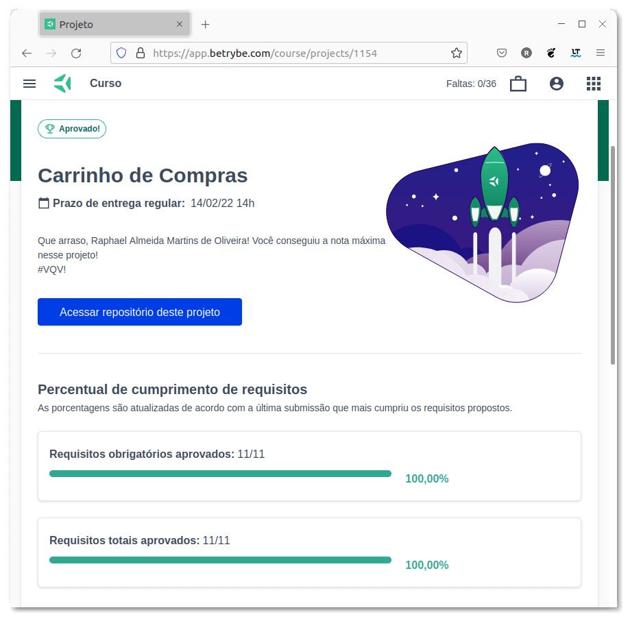

# Shopping Cart :shopping_cart:

## :page_with_curl: About

Project of HTML, CSS, and JavaScript developed by me ([Raphael Martins](https://www.linkedin.com/in/raphaelameidamartins/)) at the end of Unit 9 ([Principles of Web Development Module](https://github.com/raphaelalmeidamartins/trybe_exercicios/tree/main/1_fundamentos-do-desv-web)) of [Trybe](https://www.betrybe.com)'s Web Development course. I was approved with 100% of the mandatory and optional requirements met.

We developed a dynamic web page fetching for products data from the [Mercado Livre](https://www.mercadolivre.com.br/)'s API. We also had to implement unit tests by using the Jest framework to verify our asynchronous functions. The page is an ecommerce website that the user can add or remove items from the shopping cart.

[Click here](https://raphaelalmeidamartins.github.io/shopping-cart/) to check out the final version of the project on your browser.

## :man_technologist: Developed Skills

* Use asyncronus functions to fetch data from a API
* Implement unit tests to these functions with Jest
* Develop a web page using HTML, CSS and JavaScript

## :hammer_and_wrench: Tools

* HTML5
* CSS3
* JavaScript ES6+
* Jest
* Font Awesome (icon library)

## :memo: Methodologies

* Mobile First
* Test Driven Development (TDD)

## :trophy: Grade

### :copyright: Copyright disclaimer

I developed this project for learning purposes, all the code and documentation texts in Portuguese and English are my authorship, and the rights belong exclusively to me. It is allowed to download or clone the repository for study purposes. However, it is not allowed to publish full or partial copies. This disclaimer does not cover libraries and dependencies, which are subject to their respective licenses. It also does not cover the fetch simulator in `mocks/` that was already implemented.
